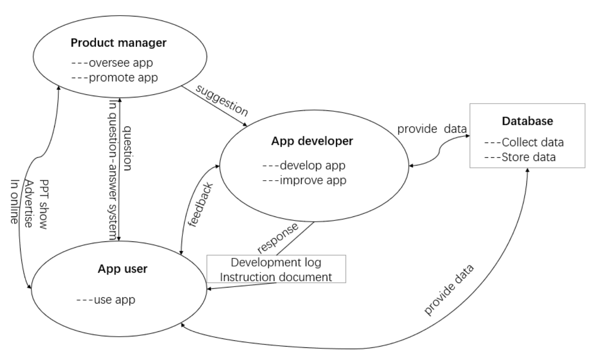
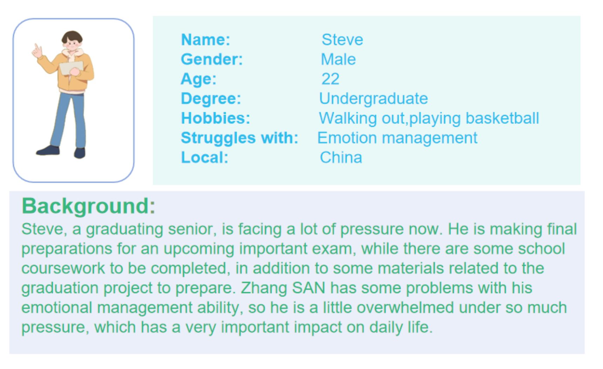
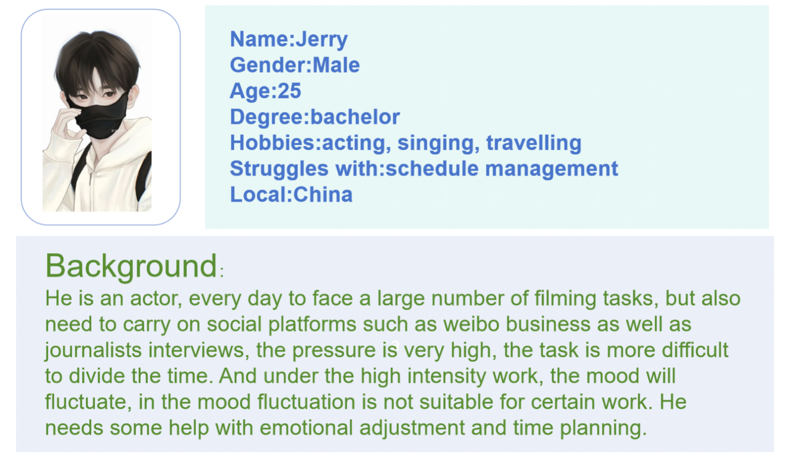
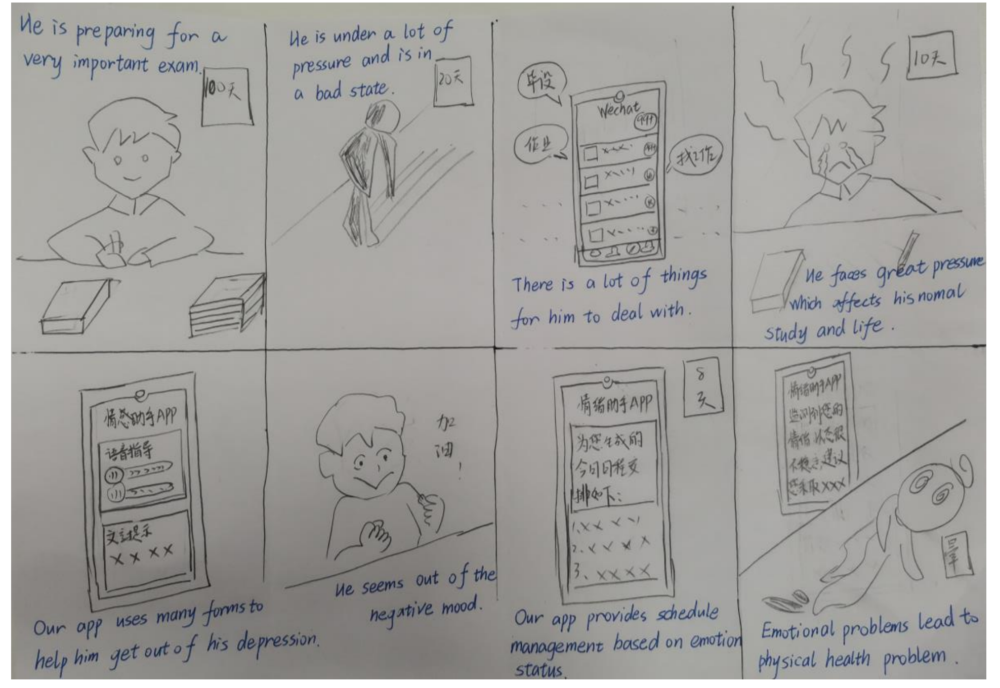
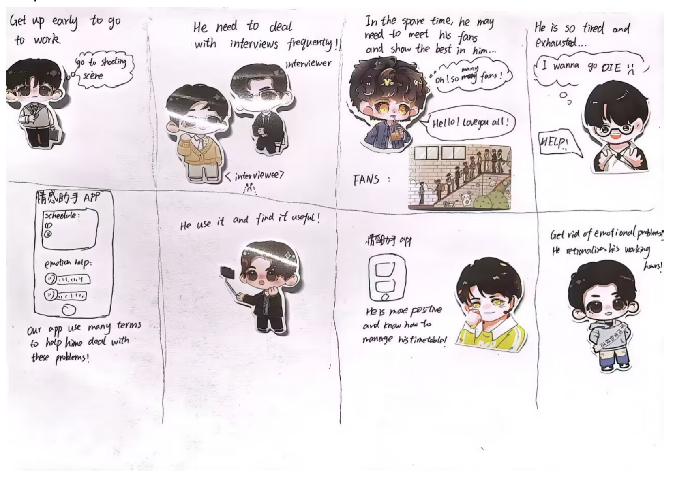

### **flow model**

### **HMW question**

- How might we encourage users to actively participate in emotion data collection on their
- phones?
- How might we make the process of emotion tracking seamless and enjoyable for users?
- How might we improve the accuracy of emotion analysis？
- How might we minimize false positives or negatives in judging a user's emotional state?
- How might we tailor emotion management suggestions to each user's unique emotional
- needs?
- How might we consider individual preferences and lifestyle factors when providing
- recommendations?
- How might we address user privacy concerns while collecting sufficient data for accurate
- emotion analysis?
- How might we transparently communicate the benefits of data collection to alleviate privacy
- concerns?
- How might we motivate users to regularly engage with the app for sustained emotional well
- being?
- How might we design features that make the app an integral part of the user's daily routine?
- How might we design the user interface and interactions to be empathetic and supportive
- during sensitive moments?
- How might we ensure that users feel understood and cared for through the app's
- suggestions and feedback?

### **Problem Statement**

As people's material lives become more and more abundant, coupled with the continuous complexity of science and technology, people's spiritual life status fluctuates greatly. While seeking material needs, people begin to pay more attention to seeking from within. The emotional needs of users cannot be underestimated. There is no app in the market today that has a global monitoring system. By monitoring the use of each application, it can overall judge the user's emotional status and give and provide suggestions and management to help people better control their emotions and life. Therefore, we proposed to design an app that can monitor people's emotions globally. It monitors the user's various activities on the mobile phone, determines the user's current emotional state, and gives suggestions and guidance. How to improve the performance of the app so that more people can benefit is also a question.

### Persona

#### Persona1

#### Persona2

### Storyboard

#### Storyboard1

#### Storyboard2

### **Solution Proposal**

Emotional problems may often lead to physical health problems, so when  designing the functions of the emotion analysis assistant, you can set a health-related functional  block or link with other apps to solve this problem.

If a user feels anxious or uneasy at a certain time of the day, the assistant can automatically adjust the schedule to schedule more relaxing or enjoyable tasks at that time to help the user relieve emotional stress. If the user is feeling excited or energized, it can offer more challenging tasks or schedules. Users can make suggestions to developers or product managers through feedback or Q&A systems. The product manager promotes the app through advertising and other methods. The app data is stored in the database to help developers better improve the performance of the app. All of this adds up to a complete closed loop that helps the app improve. And besides, when designing the function of emotion analysis assistant, the next todolist function board can be linked to emotional adjustment suggestions and work arrangement suggestions, to cope with the work in the most appropriate physical and mental state.