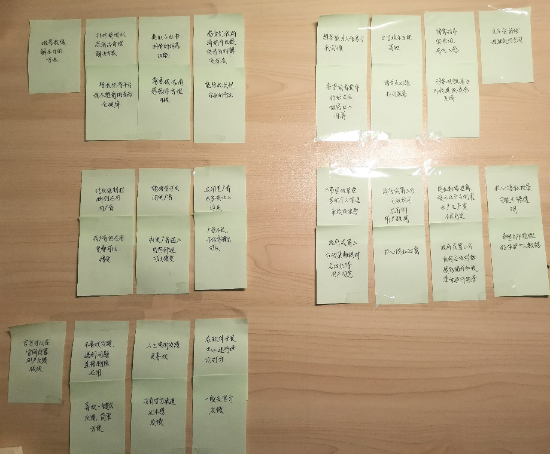
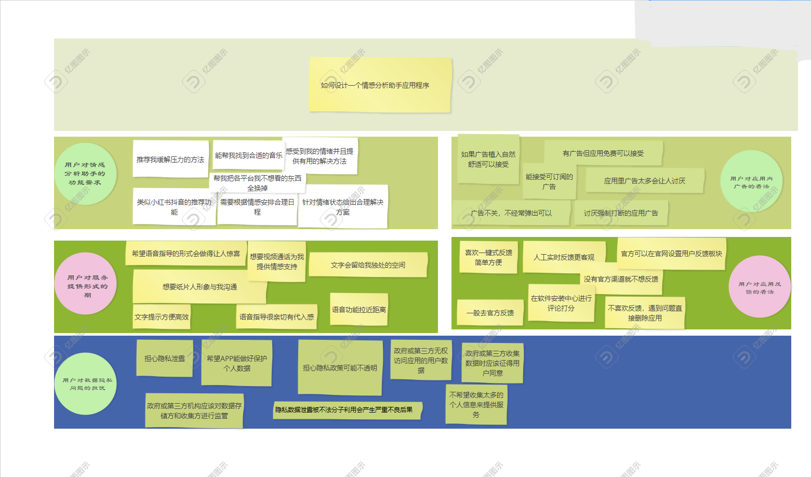

# 用户反馈&&解决方案

## overall statement

We invited developers, other executives, clients, etc. to provide critique feedback on our product prototype. They raised questions and made some suggestions in terms of interface design, technology, business goals, user process feasibility, etc.

## critique feedback and solutions

#### UI design

1. **Question:** The opening interface is very unique and different from regular APPs, but is it too simple? Have you considered adding some functional options?

   **Answer:** The picture is clear and concise, giving a good first impression and helping users have a good mood. At the same time, this interface has a very personal style, which can attract attention and remain unique.

   **Follow-up:** Having only one wake-up button is irrelevant and has no real function. It may increase the user's burden and destroy the user experience.

   **Answer:** In order for the app to win in the competition among similar software markets, it must remain unique, so we feel there is no need to change it.

2. **Problem:** The word "wake up" on the opening interface may give users an experience of starting a game, which is not too serious and does not feel consistent with the identity of an emotional assistant.

   **Answer:** On the contrary, just as many games will choose such words, we think this will give users a better experience.

3. **Question:** Although the app's main interactive platform page gives users many options for interaction, is it a bit complicated and redundant to operate, which increases the user's burden?

   **Answer:** We feel that these three methods each have their own needs, and each is irreplaceable. But there is indeed redundancy and unreasonableness in operation. We should automatically select the output form based on user input or let the user choose the output form. Instead of first letting the user choose a way to limit them to a fixed mode.

   **Follow-up:** Video and text can perfectly complete the task of voice. Perhaps the voice option can be removed.

   **Answer:** Judging from the experience of apps such as WeChat, voice is still necessary. It is more convenient than text input and simpler than video in some cases. Moreover, during user research, we found that users have special expectations for voice.

4. **Problem:** Since the recommended schedule has been imported into the calendar and memo on the schedule page, the user can view it directly, and the interface still displays whether the schedule table is redundant.

   **Answer:** It is indeed redundant and can be removed.

#### Technical feasibility

1. **Question:** Everyone’s emotional state is different and they want different responses. Is this technically possible? Whether the existing model can truly analyze the user's true emotional state and give reasonable suggestions.

​        **Answer:** With the rise of large models, the latest technology can achieve relatively high accuracy. So our idea is technically feasible.

2. **Question:** If the user's reply contains a lot of text and other forms, can the sentiment analysis assistant automatically provide a reasonable and beautiful layout output?

​       **Answer:** We checked the information and found that there is corresponding research that can solve this technical problem.

#### Alignment of design or prototype with business goals

**Question:** When originally designed, there was a function that could provide voice packages for some users' favorite voice assistants, but this function was not reflected in the prototype. Does the real app implement this function?

 **Answer: **Don't worry, this cannot be described due to space limitations, but this is the request of many users, and we have implemented it.

#### User flow availability

**Question:** But looking at the prototype, the user process is not very clear, and there is no overall introduction and guidance of the user process.

**Answer:** This was an oversight on our part. We will provide clear user processes in the subsequent process.

### Expected improvement

Based on these critique feedback, we made some improvements to the prototype. First of all, on the UI, we retained the startup interface and redesigned the subsequent interactive interface to make it better interact with users and provide users with a better experience. We held discussions with participants and determined that our technology was feasible to design such an emotional assistant. We always keep the real design consistent with our original goals. Finally, we will explain the user process in order to give users a better experience.

# 情感分析app分析

本小组由史惠敏、王乾润、苗琳瑜采访了6位受访者，关于他们对情感分析app的分析情况，由陈炜麟对这些采访稿进行汇总，并发布survey调查问卷，最后汇总制作成网页。

## 采访稿

**------1、2、3、4、5、6分别代表不同的受访者**

### 介绍

**用户您好，感谢您留出时间参与我们的采访。我们即将推出一个移动应用程序** 
**情感助手。现在我们想对您进行采访以调查用户的需求和意见，如果我使用您的回复作为我们项目的一部分可以吗？** 

**您可能会觉得我的一些问题太私人了，如果您对回答这些问题感到不舒服您可以告诉我，我会继续进行后续采访。在我开始之前您还有什么疑问吗？**

<u>1没什么疑问，可以开始了</u>

<u>2好的，没什么问题，我们可以开始</u>

<u>3没，你问吧，有些可能答不上来</u>

<u>4没问题，开始吧</u>

<u>5你问吧，我尽力回答</u>

<u>6没有，我们继续。</u>

### 热身

**您现在是学生还是已经参加工作？您觉得自己手机上应用程序多吗？**

<u>1我目前是一名即将毕业的大学生。我个人觉得自己手机上app并不多，因为许多热门的app我都没有下载，因为不是很感兴趣。我一般只下载比较实用的，如果不经常使用我就会很快清理掉。</u>

<u>2我目前是一名大一学生，不是很多，感觉app占内存</u>
<u>3我目前是一名大四学生，有很多app，游戏之类的娱乐app居多，其他的用完不常用了我就卸载了。</u>
<u>4大四学生，只留下必要的app和我需要持续登录的/充了钱的app，其他的用完就卸载，什么时候用什么时候安装，能用小程序或者网页版就不下载app，看着很乱。</u>

<u>5是的，我还是学生。没有数过，但感觉不少，常用的其实也就少数几个。</u>

<u>6我今年刚刚毕业入职。我手机上app数量有点多，有很多平时工作会用到的app，还有一些用来放松娱乐的app。</u>

**您一般会去应用商店下载一些看起来有趣的应用程序吗？当听到情感助手这个词时，您认为它会是个什么样的应用程序？**

<u>1有趣的应用有时候也会下，但是我更看重实用性，如果对我的生活确实有用，我一定会是它的长期忠实用户。情感助手听起来感觉是个帮人分析情感问题的app，就像网络心理医生一样。</u>

<u>2不会。只下载需要的。我觉得是打开可能给你推送什么“正能量”的内容比如鸡汤之类的？但说实话我会担心它像是韩国的那个桥一样，越是鼓励大家“为了什么活下去、坚持下去”，可能适得其反，因为AI不像是人，它不可能很确切的共情然后给出合理反应吧，可能它认为是正能量的东西反而刺激了用户呢。</u>
<u>3不会。我感觉，这是个那种心理测试之类的app吗？就帮你分析的话不是有很多那种做测试题给你分析你的心理状态的？</u>
<u>4也许吧，不经常，有趣的怕不安全，很多app又觉得没必要。我觉得像华为智慧助手那样的，监测你的手机然后有时候发现你精神状态不行叮地蹦出来，给你一点什么提示之类的。</u>

<u>5会的。苹果手机的AppStore我觉得很不错，有时候我就会去里面淘一些app来看看。应该是根据某些信息来判断你的情绪状态，然后给你一些相关建议去改善情绪这类的助手吧。</u>

<u>6一般不会自己看到有趣的app就下载，通常都是很多人推荐的app我才会下载。情感助手听起来是解决情感问题的，难道是提供情感安慰的app?</u>

### 主题 1：情绪分析中调度管理的需求

#### Q1. 您在日常生活中是否经常面临情绪波动或情绪压力？ 

<u>1肯定有压力吧，大家都会有，但我不会怎么内耗，情绪波动也不大。</u>

<u>2有时候有压力但不会焦虑，我比较心大，没什么负面情绪波动，比较佛。</u>

<u>3经常有，持续内耗，情绪压力很大，情绪波动频繁，挺难受的。</u>

<u>4情绪波动和压力肯定是有的，但是不太经常，我的情绪还是比较稳定的。</u>

<u>5我感觉在日常生活中经常有各种原因产生的压力，情绪波动的情况也比较多。</u>

<u>6经常。从校园步入职场，有很多不适应的地方，一切都要从头学起，每天压力巨大。</u> 

#### Follow up：可以谈谈情绪波动或压力的具体原因吗？比如说学习很紧张或工作压力大之类的。

<u>1在大学四年的生活里，因为没有去实习，所以大部分压力都来自学习。就最近来说，作为即将毕业的大学生面临各种对于未来方向的选择，真的压力很大，经常怀疑自己的选择，怀疑自己是不是不够努力，是不是努力错了方向，是不是都在做无谓的努力。</u>

<u>2比如有时候作业距离提交还有几小时，但是自己还没做，这个时候就会比较烦躁。</u>

<u>3身边同学都保研很好，自己考研准备的不行，焦虑</u>

<u>4父母期待很大，自己达不到父母的预期</u>

<u>5一个是学习和复习考研压力大，一方面是情感方面的问题，和女朋友相处不融洽</u>

<u>6刚参加工作，无论是工作压力还是人际交往的压力都让我非常难受。</u> 

#### Q2. 您觉得情感波动或情感压力对您的日常任务和时间管理有严重的影响吗？可以描述一下有多严重吗？

<u>1不大，要做一个理性的人啊，怎么能让这些控制你呢（笑）</u>

<u>2不大，我没啥情绪波动</u>

<u>3啊严重，可能不累但是人因为焦虑先崩溃了，就完全做不进去事情，身体会很不舒服。很害怕很害怕，然后把事情反而弄砸，就像马上交卷子但还是没写完一样的慌张感，导致了效率的低下，玩也玩不好。</u>

<u>4我觉得是的。比如上一个例子的情景，当我比较烦躁时，我的效率会下降，导致我需要比平时更多的时间去完成作业。而且会打乱我的计划，让我不想去按计划去做接下来该做的事情。我觉得有时候它的影响还是比较严重的。</u>

<u>5对于我来说影响还是挺大的，我如果情绪很不对劲，学习效率会大幅下降。比如发现学习进度远远落后于其他人，而且复习时间完全不够时，越想越崩溃，就会很想放弃，但这会使本来就落后的复习进度雪上加霜，这非常让人苦恼。</u>

<u>6有点严重，但作为一个成年人还是可以克服的，虽然很痛苦。</u> 

#### Q3. 您在面对情感波动或情感压力时都是怎样缓解的？您对于情感管理技巧（如放松方式、舒缓策略等）有了解吗？

<u>1看喜欢的东西，让自己高兴的东西，比如《天官赐福》那个小说嘛，你懂的，看看就很开心啊。</u>

**追问：你会一直看吗？直到缓解？还是怎么样**

<u>答：我肯定会限制时间啊，怎么能一直看呢（笑）就你规定自己写四十分钟作业，看20分钟的小说，再写半个小时这样子，就算我高三的时候，我也每天看喜欢的小说，我知道别人在写卷子，但我不care，每个人有每个人的节奏吗，你得找到属于你的节奏啊是吧。</u>

<u>2我刷刷抖音，看看名学（某综艺团体），然后就开心了呀</u>

**追问：你会一直看吗？直到缓解？还是怎么样**

<u>答：emmm……我不太控制的住说实话，会看的比较久</u>

**追问：那你这样看完不会更焦虑吗，比如做事情的时间又少了**

<u>答：不会啊，我一般不焦虑，其他的心情不好看看这个可以变好，因为忘了嘛。再说为什么要一直有需要做事情这个想法呢，人要有空闲时间的呀。</u>

<u>3我会想要发泄的，比如坐过山车、保证安全的前提下把车开的很快、暴打抱枕，偶尔快速跑步。也会和朋友大声的打电话。或者写小说剪视频，把不开心的情绪都放在在这里面的同时，沉浸在创作里就会忘记不好的心情了。只看视频看小说不干事情对我没用。</u> 

<u>4我一般会选择向家人朋友倾诉，当得到他们的支持和安慰时，压力会很快排解掉。我了解的一些情感放松方式还有体育锻炼，听说非常有用，三公里就能治好各种心理不适。还有一些购物，吃甜品，写日记，虽然没试过但据说有用。</u>

<u>5我有时候会出去跑步缓解压力。平时的话一般是听听音乐或者放下手头的事情打打游戏。比较专业科学的情感管理技巧我不太了解，我觉得这个是一个比较主观的事情，每个人有每个人特定的方式。</u>

<u>6我会去健身房，而且我认为这个方法非常有效。我现在还在家附近办了健身房年卡，工作上一有压力我就去那里放松。别的方式的话，我还会选择购物，一次性冲动消费会很解压。</u>

#### Q4. 您认为一个手机应用情感分析助手可以为您提供一些怎样的服务来帮您缓解情感压力？

<u>1啊我觉得那些小红书抖音的推荐就挺好的</u>

<u>2该说不说我觉得不如刷会抖音</u>

<u>3如果可以的话帮我把我不想看的东西一个都别推送，比如我微信聊天说xxx太卷了，那我所有平台别推送这个人和卷的事情。</u>

<u>4我希望它能感受到我的情绪问题并且可以提供有用的解决方法，让我的生活不会因为情绪压力变得一团糟。</u>

<u>5我能想到的是帮我找一些合适的音乐，或者推荐我一些缓解压力的简单好用的方法。</u>

<u>6我觉得它应该通过对我现在情绪状态的分析给出一个合理的解决方案，让我尽快恢复正常。</u>

#### Q5. 您希望情感分析助手通过什么方式向您提供情感支持和建议？例如文字提示、语音指导或其他形式？

<u>1文字吧，难过时候想独处</u>

<u>2我希望可以和它视频通话</u>

<u>3给我点现实而不是空泛的建议。还有我想要这个东西像人一样陪我，我想要搭建一个属于我的线上小窝，或者这能以我喜欢的纸片人形象和我沟通。</u>

<u>4我希望多种形式结合，因为文字提示，语音指导，图片示例，动画演示都有其各自的优点。但是就我个人而言，我对于语音指导更感兴趣，因为语音互动很有亲和力，容易拉近和用户的距离。如果可以做的很优秀，应该会吸引很多和我一样的用户。</u>

<u>5文字提示吧。这样不太突兀。</u>

<u>6我希望是语音指导和文字演示，前者比较有代入感，后者比较方便高效。</u>

#### Q6. 您认为情感分析助手根据情感进行日程安排是否合理，是否必要？并且讲述一下您的理由。

<u>1啊我觉得我担心隐私</u>

<u>2没必要，不需要，不受这个影响</u>

<u>3是吧，但我不太相信这个能完美达成预期。我破防的时候失去理性思考规划能力，挺需要的。</u>

<u>4我觉得非常合理且有必要，在我遇到巨大的情感压力的时候，会失去对自己生活的掌控力，可能会颓废好几天直到随着时间缓缓恢复，但这期间其实浪费了很多时间，我非常不喜欢这样但没有办法。情感分析助手如果可以在我不能掌控自己生活的时候接管这一项任务，帮我安排一些缓解压力的日程和一些在不同情绪下适合的不同类型任务，那既能帮我尽快走出压力的漩涡，还可以让这段时间过得有意义有价值，这真的是非常让人期待的一个应用呢。</u>

<u>5我觉得如果大部分时间情绪稳定的话，这个还是一个不错的想法，或许可以让人的效率更好。但是我觉得这不是必要的。因为每个人都有自己的习惯，一个app不太能了解一个人的全部信息。</u> 

<u>6我觉得合理。在工作中遇到压力即使佷崩溃也要继续完成工作，所以在自我管理能力不足时，让它来合理安排日程很有必要。</u>

### 主题 2：用户隐私和安全

#### Q1. 您了解情绪分析应用程序会如何使用您的数据来提供服务吗？如果不清楚，您想在哪里找到有关数据使用的更多信息？

<u>1不了解，应该是数据监听，然后app之间可能会收集交换甚至出售数据</u>

<u>2不了解，但觉得会麦克风监听。下载的时候我就关了权限。</u>

<u>3不了解。设置-权限</u>

<u>4这点我确实不是很清楚，我觉得它应该会监控利用我在其他app上的使用信息，还有我的输入文字和语音。我觉得app应该在安装时就告知我它会使用我的哪些信息，以及如何使用，这样用户可以按照接受度选择是否继续使用。</u>

<u>5我知道它会利用我的数据，但是怎样利用的我并不清楚。我没太关心过这个。或许在app里设置一个选项可以让人清楚的看到数据是如何被使用的。</u>

<u>6我不清楚，我觉得app应该在安装时就告知我，在后续使用也要有相应的提示。</u>

#### Q2. 您是否希望情绪分析应用程序提供允许您管理和删除自己的数据的用户控制选项？

<u>1是，但恐怕删不了，它难道不会自己存吗</u>

<u>2是</u>

<u>3是，但觉得删不干净</u>

<u>4当然，这必须提供，自己当然要拥有管理自己数据的权限。</u>

<u>5我认为可以设置，但是我觉得大部分用户不会使用这个功能。</u>

<u>6非常希望。</u> 

#### Q3. 您认为政府或其他第三方机构应该有权访问由应用程序收集的数据吗？如果是这样，您认为应该有什么限制和条件？

<u>1无权！</u>

<u>2无权</u>

<u>3无权，但现实是他们已经这样干了。</u> 

<u>4我觉得政府或者第三方不应该有权访问数据，但他们应该具有对数据收集和存储方的监管权限。</u>

<u>5我认为它们的权限应该是用户同意赋予的。如果用户不知情的话，那它们不能自私收集数据。可以让它们收集一些非敏感信息吧，并且禁止外传。</u>

<u>6我觉得政府或者第三方应该有权访问数据，同时他们也应该具有相应监管权限。</u>

#### Q4. 如果应用程序提供个性化的情绪分析建议或反馈，您是否愿意允许应用程序访问更多个人信息关于你提供更精准的建议？为什么或为什么不呢？

<u>1不，我担心隐私泄露。个人隐私不希望收集。虽然注册时候已经窃取了。</u>

<u>2不需要建议</u>

<u>3可以，反正泄露了不差这一点</u>

<u>4如果应用程序可以保证用户的隐私数据不会被泄露，那我当然愿意允许它访问更多个人数据来提供更好的服务。但是大部分的应用很难让人信任。</u>

<u>5如果它提出的建议或反馈比较好的话，那我不介意。</u>

<u>6我不愿意，我害怕隐私信息泄露。</u>

#### Q5. 使用情绪分析应用程序时，您最大的隐私问题是什么（例如保护个人数据、数据泄露、隐私政策的透明度等）?

<u>1全方位的担心，担心泄露给第三方</u>

<u>2都担心，但都泄露，这很可怕</u>

<u>3数据一定会泄露的……</u>

<u>4我最担心的就是隐私数据泄露，隐私数据如果被不法分子恶意利用，后果可能会非常严重。</u>

<u>5数据泄露吧，感觉别人知道了你的信息然后给你推销或者做一些其他事情很可怕。</u>

<u>6我担心隐私数据泄露。</u> 

### 主题3：应用运营模式

#### Q1. 如果您在使用应用程序时遇到问题，您会选择报告问题给开发商吗？

<u>1会，提供服务就得服务到底！</u>

<u>2不会，直接注销删除，懒得，没有什么完美解决</u>

<u>3看心情</u>

<u>4我一般会的，我觉得向开发商报告使用不良体验会让他改善应用从而给我提供更好的服务。</u>

<u>5很少，我会重启或者选择其他的方式。</u>

<u>6我偶尔会。</u>

#### Follow Up：您通常如何提供反馈？是评论还是其他什么渠道？

<u>1去官方反馈</u>

<u>2在评论区吐槽</u>

<u>3官方反馈+评论区吐槽</u> 

<u>4我通常会使用官方渠道，比如官方在官网设置的用户反馈版块，或者是在应用里直接设置的反馈版块。如果没有官方渠道，那我极大可能就不会反馈了。</u>

<u>5我不经常。有的话，一般都是去app的评论区进行反馈。</u>

<u>6我在软件安装中心给它评论和打分。</u>

#### Q2. 如果您在使用应用程序的过程中遇到问题，请问您是否更喜欢一键式反馈或寻求客户服务以寻求答案？

<u>1一键式为主吧。如果不行的话先人工服务，再人工，都需要</u>

<u>2都需要，人工为主</u>

<u>3人工，给我实时反馈</u>

<u>4当然，简单直接实时的反馈自然会更受喜欢。</u> 

<u>5一键反馈吧。这样很方便。</u>

<u>6对，我喜欢这种迅速实时的反馈。</u> 

#### Q3. 您是否认为有必要在多台设备上同时登陆吗？ 

<u>1需要</u>

<u>2需要，手机电脑平板需要，两个手机有点必要但是不多。</u>

<u>3需要，我觉得俩手机互相挤占更好</u>

<u>4当然，现在大部分人都会经常使用不同的设备，多台设备同时登陆自然会提供很大方便。</u>

<u>5我觉得这很需要。因为现在很多人都有不少设备。</u>

<u>6我觉得没有必要，因为我一般不会同时登陆多台设备使用这种app，多设备同时登陆会让我感觉不太安全。</u>

#### Q4. 您如何看待应用内广告？

<u>1多了就很讨厌能不能关了</u>

<u>2可以接受有，但是不接受多，适当赚钱可以理解</u>

<u>3可以接受可关闭的，讨厌强制打断使用的</u>

<u>4作为学生党，虽然我很讨厌应用内广告，但是如果可以因为广告而变成免费应用，那我将非常乐意。当然前提是这些广告的设置不会让人厌恶，例如讨厌的弹窗广告，而且如果是让人舒适的广告植入那就更好了。</u>

<u>5只要不是太长也不是经常突然弹出，我不反感。</u>

<u>6非常讨厌，应用内广告会让我立刻删除这个应用。</u>

#### Q5. 您更喜欢哪种应用订阅模式？如一次买断、会员制还是其他？

<u>1不贵的买断吧</u>

<u>2一次买断，或者全免费，会员特权不能影响正常使用。</u>

<u>3我要白嫖，接收功能升级一次买断付费</u>

<u>4作为学生党，我觉得免费最好，如果一定要付费，那么按月或者按年的付费会员制可以接受。</u>

<u>5如果做的好的话，我选择终身买断制。</u>

<u>6我喜欢会员制。</u>

### 结束

#### 如果我们的应用程序已经可供下载，您会尝试吗？

<u>1不会，占内存，只会为了人情世故而不是功能体验下载</u>

<u>2不会，对我没用</u>

<u>3会，悲观尝试，不行就卸</u>

<u>4我会很乐意尝试的，希望它在语音指导的形式上和日程管理的功能上都有让我惊喜的表现。</u>

<u>5我挺感兴趣，我会下载来试一试。</u>

<u>6我应该会尝试的。</u>

#### Follow Up：你选择使用它的原因是什么？

<u>1人情世故捧场</u>

<u>2不想用</u>

<u>3说不定有用，反正免费还能卸载。</u>

<u>4因为它提供的功能目前还没有其他app有完全相同的功能集成，而且我真心认为这个app会改变用户的生活，可以让用户对自己的生活有更强的掌控力，这是非常吸引我的点。</u>

<u>5我觉得这是一个比较新型的app，能给我的生活带来便利，提高我的效率。</u>

<u>6我觉得它对我还是有一些用处的，前提是那些关键功能都完美实现。</u>

### **感谢您的回复！**

## survey数据

**关于情感分析app的使用情况调查**

本小组总共采访了13份数据，统计的人地域分布如下

得到的数据如下

第1题   您现在的工作是？      [单选题]

| 选项             | 小计 | 比例    |
| :--------------- | :--: | :------ |
| 政府部门人员     |  1   | 7\.69%  |
| 自由职业者       |  2   | 15\.38% |
| 待业             |  0   | 0%      |
| 学生             |  10  | 76\.92% |
| 其他：           |  0   | 0%      |
| 本题有效填写人次 |  13  |         |

第2题   您使用手机中常用应用程序的频率如何？      [单选题]

| 选项             | 小计 | 比例    |
| :--------------- | :--: | :------ |
| 约1小时          |  2   | 15\.38% |
| 约2小时          |  6   | 46\.15% |
| 约4小时          |  4   | 30\.77% |
| 约8小时          |  1   | 7\.69%  |
| 其他：           |  0   | 0%      |
| 本题有效填写人次 |  13  |         |

第3题   您多久会经历一次剧烈的情绪波动或情绪压力？      [单选题]

| 选项             | 小计 | 比例    |
| :--------------- | :--: | :------ |
| 很少             |  1   | 7\.69%  |
| 适中             |  9   | 69\.23% |
| 经常             |  3   | 23\.08% |
| 本题有效填写人次 |  13  |         |

第4题   您认为情绪波动或情绪压力在多大程度上影响您的日常生活？      [滑动条]

本题答卷总分值：67；平均值为：5.15

第5题   您面对情绪压力时的自我调节能力如何？      [滑动条]

本题答卷总分值：85；平均值为：6.54

第6题   当你遇到情绪波动或情绪压力时，你通常会选择与他人交往吗？      [单选题]

| 选项             | 小计 | 比例    |
| :--------------- | :--: | :------ |
| 是               |  7   | 53\.85% |
| 否               |  6   | 46\.15% |
| 本题有效填写人次 |  13  |         |

第7题   你如何应对情绪压力？      [单选题]

| 选项             | 小计 | 比例    |
| :--------------- | :--: | :------ |
| 不处理           |  3   | 23\.08% |
| 线上发泄         |  5   | 38\.46% |
| 线下发泄         |  4   | 30\.77% |
| 其他：           |  1   | 7\.69%  |
| 本题有效填写人次 |  13  |         |

第8题   您是否经常使用手机进行日程管理，例如使用备忘录、日历等？您对这种形式的日程管理有什么不满意的地方吗？      [单选题]

| 选项             | 小计 | 比例    |
| :--------------- | :--: | :------ |
| 是               |  8   | 61\.54% |
| 否               |  3   | 23\.08% |
| Answer：         |  2   | 15\.38% |
| 本题有效填写人次 |  13  |         |

第9题   您曾经使用过情感分析应用程序吗？      [单选题]

| 选项             | 小计 | 比例    |
| :--------------- | :--: | :------ |
| 是               |  3   | 23\.08% |
| 否               |  10  | 76\.92% |
| 本题有效填写人次 |  13  |         |

第10题   您愿意分享您的社交媒体或短信以获得更准确的情感分析结果吗？      [单选题]

| 选项             | 小计 | 比例    |
| :--------------- | :--: | :------ |
| 是               |  3   | 23\.08% |
| 否               |  10  | 76\.92% |
| 其他：           |  0   | 0%      |
| 本题有效填写人次 |  13  |         |

第11题   您是否愿意使用应用程序提供的用户支持和投诉渠道来报告与隐私和安全相关的问题？      [单选题]

| 选项             | 小计 | 比例    |
| :--------------- | :--: | :------ |
| 是               |  7   | 53\.85% |
| 否               |  6   | 46\.15% |
| 本题有效填写人次 |  13  |         |

第12题   您对情感分析应用程序的数据存储和保留期限有哪些担忧？      [单选题]

| 选项                             | 小计 | 比例    |
| :------------------------------- | :--: | :------ |
| 担心数据被永久存储               |  7   | 53\.85% |
| 希望有更多关于数据保留的控制选项 |  2   | 15\.38% |
| 不关心                           |  4   | 30\.77% |
| 本题有效填写人次                 |  13  |         |

第13题   如果您愿意共享数据，您希望应用程序收集哪些数据？      [多选题]

| 选项             | 小计 | 比例    |
| :--------------- | :--: | :------ |
| 文本信息         |  8   | 61\.54% |
| 社交媒体账户信息 |  5   | 38\.46% |
| 地理位置信息     |  5   | 38\.46% |
| 图片             |  6   | 46\.15% |
| 音频             |  2   | 15\.38% |
| 其他：           |  0   | 0%      |
| 本题有效填写人次 |  13  |         |

第14题   你会为你最喜欢的应用程序付费吗？      [单选题]

| 选项             | 小计 | 比例    |
| :--------------- | :--: | :------ |
| 会               |  8   | 61\.54% |
| 不会             |  5   | 38\.46% |
| 其他：           |  0   | 0%      |
| 本题有效填写人次 |  13  |         |

第15题   你会看应用内的广告吗？      [单选题]

| 选项             | 小计 | 比例    |
| :--------------- | :--: | :------ |
| 会               |  3   | 23\.08% |
| 不会             |  10  | 76\.92% |
| 本题有效填写人次 |  13  |         |

第16题   您认为什么样的APP运营模式更好？      [单选题]

| 选项                         | 小计 | 比例    |
| :--------------------------- | :--: | :------ |
| 买断制（一次付费，终身有效） |  4   | 30\.77% |
| 订阅制（按月/年付费）        |  2   | 15\.38% |
| 免费但有广告                 |  5   | 38\.46% |
| 会员制                       |  2   | 15\.38% |
| 其他：                       |  0   | 0%      |
| 本题有效填写人次             |  13  |         |

## Survey 数据分析

### 重要发现

1. **情感分析应用需关注用户隐私和数据安全：**
    - 53.85%的受访者担心数据被永久存储，表明用户对于个人数据的安全性有一定关切。
    - 23.08%的用户愿意分享社交媒体或短信以获取更准确的情感分析结果，但76.92%的用户不愿意分享，显示用户在隐私权和个人信息控制方面有不同的态度。
    - 对于应用程序提供的用户支持和投诉渠道，53.85%的用户表示愿意使用，这表明建立明确的隐私保护措施和沟通渠道对用户满意度至关重要。
2. **用户对日程管理应用有较高的使用率，但对情感分析应用的使用较低：**
    - 61.54%的用户使用手机进行日程管理，这显示了在工作和日常生活中，用户对于日程安排的需求。
    - 76.92%的用户尚未使用过情感分析应用，这可能表明情感分析应用需要更好地推广和满足用户需求。
3. **用户在付费和广告方面存在分歧：**
    - 61.54%的用户愿意为他们最喜欢的应用程序付费，这显示了用户对高质量应用的愿意支持。
    - 76.92%的用户不愿意看应用内广告，这表明用户更倾向于选择无广告的应用体验。
    - 在运营模式选择上，38.46%的用户认为免费但有广告的模式更好，而30.77%的用户支持买断制（一次付费，终身有效），这反映了用户对于不同运营模式的偏好存在差异。

### 描述统计数据

1. **职业分布：**

    - 政府部门人员：1 (7.69%)
    - 自由职业者：2 (15.38%)
    - 待业：0 (0%)
    - 学生：10 (76.92%)

    **总结：** 多数受访者（76.92%）为学生，自由职业者和政府部门人员分别占15.38%和7.69%。

2. **手机应用使用频率：**

    - 约1小时：2 (15.38%)
    - 约2小时：6 (46.15%)
    - 约4小时：4 (30.77%)
    - 约8小时：1 (7.69%)

    **总结：** 最常见的使用时长约为2小时（46.15%），其次是4小时（30.77%）。

3. **剧烈情绪波动频率：**

    - 很少：1 (7.69%)
    - 适中：9 (69.23%)
    - 经常：3 (23.08%)

    **总结：** 绝大多数受访者（69.23%）经历适中程度的情绪波动，只有少数（7.69%）很少经历。

#### 摘要统计：

1. **情绪波动对日常生活的影响：**

    - 平均值：5.15

    **总结：** 平均而言，受访者认为情绪波动在一定程度上影响他们的日常生活，得分为5.15，总分为67。

2. **面对情绪压力的自我调节能力：**

    - 平均值：6.54

    **总结：** 平均而言，受访者在面对情绪压力时的自我调节能力得分为6.54，总分为85。

#### 附加见解：

1. **社交互动偏好：**

    - 选择与他人交往：7 (53.85%)
    - 不选择与他人交往：6 (46.15%)

    **总结：** 稍多数受访者（53.85%）在面对情绪压力时选择与他人交往。

2. **情绪压力应对机制：**

    - 不处理：3 (23.08%)
    - 线上发泄：5 (38.46%)
    - 线下发泄：4 (30.77%)
    - 其他：1 (7.69%)

    **总结：** 最常见的应对机制是在线上发泄（38.46%）。

### 主题和类别

样本中主导的人口统计特征是学生，表明受访者以年轻人为主。对手机应用的使用模式的分析显示，相当数量的参与者在手机上花费约2小时的时间，大多数人更喜欢较短的使用时长。

### 出乎意料的事情

出乎意料的发现之一是用户对情感分析应用的使用和隐私问题表现出明显的矛盾态度。尽管有相当大比例的用户表示担心数据永久存储，但多数受访者并未使用过情感分析应用，表明他们在使用此类应用时存在一定的犹豫。这种矛盾反映了用户对新兴技术的谨慎态度，尤其是涉及到敏感个人信息的情感分析。

## Interview 数据分析

### 过程图片

### 最终输出

### 亲和图数字版本

### 描述文字

最后的亲和图将35张便利贴分为五部分，每一部分的小主题分别是：用户对情感分析助手的功能需求，用户对服务提供方式的期待，用户对应用内广告的看法，用户对应用数据隐私问题的担忧，用户对应用反馈的看法。最后得出的总主题是：如何设计一个情感分析助手应用程序。从最后的亲和图我们可以得出一些结论：

1、用户希望情感分析助手提供一些可以解决情绪压力问题的功能，如合理安排日程，替换不喜欢的推送内容等。

2、大部分用户对于应用服务提供方式希望采用语音和视频等更具有亲和力的形式，也有用户喜欢高效的文字形式。

3、用户对应用内广告的看法，大部分是可以接受部分合适的广告，反感数量多，强制或者可以弹出的广告。

4、用户对应用数据隐私问题基本持担忧态度，尤其是隐私数据泄露。

5、用户对于应用反馈倾向于在官方渠道反馈，一键式反馈和人工实时反馈形式都受用户喜欢。
